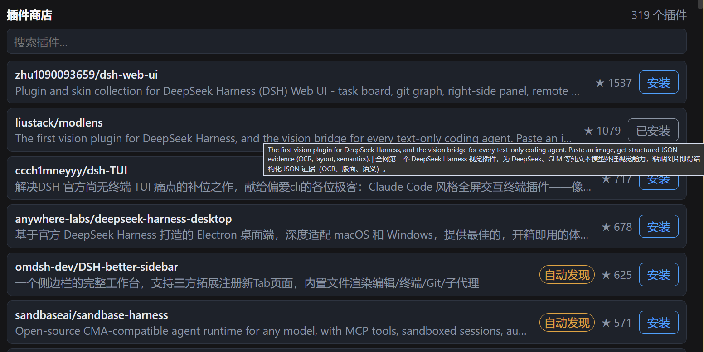

# dsh-plugin-installer

> DeepSeek Harness（dsh）的**插件商店 + 安装助手**：在 Web GUI 里逛插件目录，一键确认安装，agent 替你装好。


[简体中文](./README.zh-CN.md) · [English](./README.md)

---

## Overview

`dsh-plugin-installer` 是 dsh 的**双面插件**，一个包提供两样东西：

1. **插件商店**：Web GUI 会话视图环里的「插件商店」页签——浏览、搜索插件目录（名称 / 介绍 / 原链接 / star 数），点「安装」先二次确认，再发起安装请求。
2. **安装助手技能**：随包内置的技能，agent 按它执行安装——确认来源、选择安装路径、注册进 profile、验证结果，全程可解释、可回滚。

**适合谁**：想在图形界面里发现并安装 dsh 插件的所有用户；希望让 agent 可靠完成安装与排障的开发者。

<p align="center">
  
</p>

## Compatibility

| 项 | 支持范围 |
| --- | --- |
| dsh 生态 | `0.1.0-rc.6`（最后验证 2026-08） |
| 系统 | Windows / macOS / Linux |
| Node | ≥ 22.19 |
| 界面 | Web GUI（`dsh --profile web`）；无 GUI 的 profile 请走路线 B 仅安装技能 |

## Install / Uninstall

### 安装

**路线 A —— 完整插件（商店页签 + 技能）**，npm 发布后：

```bash
dsh plugin --profile web add dsh-plugin-installer
```

本地开发直接 link：

```jsonc
// ~/.dsh/profiles/web/package.json
{
  "dependencies": { "dsh-plugin-installer": "link:<本仓库路径>" },
  "dsh": { "profile": { "bundles": ["dsh-plugin-installer"] } }
}
```

```bash
cd ~/.dsh/profiles/web && pnpm install
```

**路线 B —— 仅安装技能**（文件系统发现，无商店 UI）：

```bash
git clone --depth 1 https://github.com/zhang66633/dsh-plugin-installer ~/.dsh/skills/dsh-plugin-installer
```

### 升级

- 路线 A：重跑 `dsh plugin add`（钉版本）；本地 link 则 `git pull` + 重新构建。
- 路线 B：`git pull`。

### 禁用

从 profile 的 `dsh.profile.bundles` 移除 `dsh-plugin-installer` 条目（依赖可保留）。

### 卸载

从 profile `package.json` 移除依赖与 bundles 条目，`pnpm install`；路线 B 删除 `~/.dsh/skills/dsh-plugin-installer`。

## Quick start

1. 安装后重启 `dsh web`；
2. 打开任意会话，视图环里出现「**插件商店**」页签（在聊天/轨迹旁）；
3. 搜索插件（如 `vision`），点「**安装**」→ 确认提示 → 当前会话的 agent 接手安装；
4. 安装完成后重启 `dsh web` 生效。

最小可复现示例：搜 `modlens` → 点安装 → 确认 → agent 报告装好 → 重启 → 发图片测试 OCR。

## 刷新（两层含义）

**商店页里的「刷新」按钮**是轻刷新：重新拉取目录，宿主会实时重算每个插件的「已安装 / 可更新」状态——**刚装完插件点一下刷新，不用重启 dsh 就能看到「已安装」**。按钮有悬浮说明，商店标题旁显示「更新于 <时间>」（目录数据的生成时间）。

**目录数据本身的更新**（新增插件、版本信息变化）需要重新生成快照：

- 维护者：运行雷达仓库的 `scripts/refresh-catalog.ps1`（discover → normalize → l1-scan → export → 重打包 → profile 重装），或交给定时任务（每日 02:00）；
- 普通用户：等维护者发布新的 npm 版本后 `dsh plugin add dsh-plugin-installer`（钉版本）升级，目录随包更新。

## Configuration

- **商店数据**：`data/store.json` 为插件目录快照（名称 / 介绍 / 原链接 / 分类 / star），随包分发，运行时不联网拉取；刷新目录 = 重建快照后重装本插件。
- **安装请求**：点「安装」只向本机 `/plugin-store/install` 发一个 JSON 请求（插件名 + 会话 id）；实际安装由当前会话的 agent 执行。
- 无其他配置项、无环境变量、无敏感项。

## Permissions & data

- 宿主进程：**只读**本包内 `data/store.json`；catalog / install 两个路由仅绑定本机 web 服务。
- 安装触发后，由 **agent** 执行安装命令（可能读写你的 dsh profile、插件目录，并联网访问 npm / GitHub）——每一步操作可见、可中止。
- 无遥测、无统计上报、不读取任何凭据。

## Troubleshooting

| 现象 | 处理 |
| --- | --- |
| 商店页签不出现 | 确认 `dsh.profile.bundles` 含 `dsh-plugin-installer`；`dsh --profile web --dump-config` 检查树；重启 |
| 点「安装」无反应 | 确认当前会话有活跃 agent；浏览器控制台查看 `/plugin-store/install` 响应 |
| 想回滚 | 移除 bundles 条目 + `pnpm install` 即卸载，profile 其余配置不受影响 |

## Development

```bash
npm install          # 安装构建依赖（esbuild）
npm run build        # 构建 lib/client.js（客户端 wire bundle）
npm run check        # 脚本语法/规范检查
npm test             # 单元测试
npm run smoke        # 冒烟：加载 lib/index.js 输出 name/inject
```

商店快照刷新：更新 `data/store.json` 后重新构建、重装即可。贡献欢迎 PR；行为变更请同步 README 与测试。

## License & security

[MIT](./LICENSE) © 2026 zhang66633

安全问题请通过 GitHub **security advisory** 私下报告，不要公开 issue。
